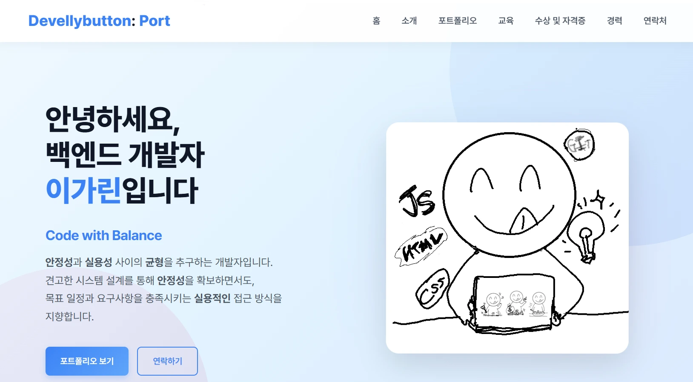

# 💼 자기소개 포트폴리오 사이트

<table style="table-layout: fixed;">
  <tr>
    <td style="width: 25%; text-align: center;">
      <a href="#️-기술">🛠️ 기술</a>
    </td>
    <td style="width: 25%; text-align: center;">
      <a href="#-구현-기능">✨ 구현 기능</a>
    </td>
    <td style="width: 25%; text-align: center;">
      <a href="#️-프로젝트-로드맵">🚀 로드맵</a>
    </td>
    <td style="width: 25%; text-align: center;">
      <a href="#-피드백">🤝 피드백</a>
    </td>
  </tr>
</table>

> 개인 브랜딩을 위한 반응형 포트폴리오 사이트입니다.  
> 모듈화된 구조로 유지보수가 용이하며, `Supabase`를 활용한 백엔드 연동도 포함되어 있습니다.

 

---

## 🛠️ 기술

- 
  
  
- 

 

## ✨ 구현 기능

- 반응형 디자인 (모바일, 태블릿, 데스크톱 지원)
- 모듈화된 코드 구조로 유지보수성 개선

 

## 🗂️ 프로젝트 로드맵

| 할 일                                                                                  | 완료 여부 |
| -------------------------------------------------------------------------------------- | --------- |
| 각 프로젝트를 해당 GitHub 소스 코드 링크와 연동                                        | ✅        |
| "맨 위로 가기" 버튼 추가                                                               | ✅        |
| "연락하기" 섹션에 "중간이들 개발자 구인" 공지 추가                                     | ✅        |
| 마우스 포인터 디자인 변경 및 hover 효과                                                | ✅        |
| 프로필 이미지 및 소개 이미지 추가                                                      | ✅        |
| '안녕하세요 OOO입니다.' 글자 애니메이션 추가                                           | ✅        |
| 파비콘 추가 `                                                                          | ✅        |
| 이미지 확장자 webp로 변경                                                              | ✅        |
| 유지보수를 위한 프로젝트 소스 분리                                                     | ✅        |
| 폼 서버와 연동해서 전송 처리 (superbase 연동)   → 브라우저 키 노출 문제로 일단 보류 | ✅        |

 

## 🤝 피드백

- 이 포트폴리오에 대한 피드백이나 개선 아이디어가 있다면 언제든 환영입니다!
- 이슈를 남기거나 PR을 보내주세요. 🙌
